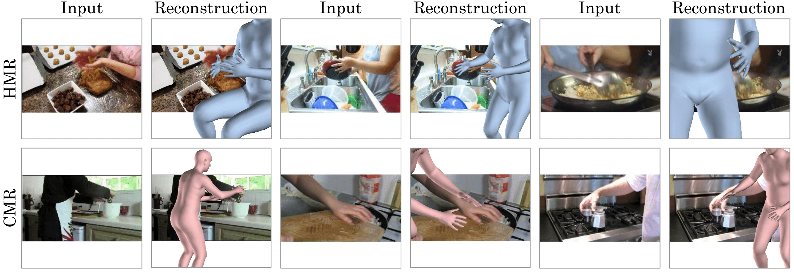

# Full-Body Awareness from Partial Observations (ECCV 2020)

Chris Rockwell and David F. Fouhey

**[[Project Website](https://crockwell.github.io/partial_humans/)] [[Paper](https://crockwell.github.io/partial_humans/data/paper.pdf)] [[Supplemental](https://crockwell.github.io/partial_humans/data/paper-supp.pdf)]**


**Fig. 1:** We present a simple but highly effective framework for adapting human pose estimation methods to highly truncated settings that requires no additional pose annotation. We evaluate the approach on HMR and CMR by annotating four Internet video test sets: VLOG (top-left, top-middle), Cross-Task (top-right, bottom-left), YouCookII (bottom-middle), and Instructions (bottom-right).


### Model Installation, Demo, Evaluation & Custom Image Setup
- [HMR](https://github.com/crockwell/partial_humans/blob/master/hmr/README.md) (Tensorflow)
- [CMR](https://github.com/crockwell/partial_humans/blob/master/GraphCMR/README.md) (Pytorch)

### Annotated Test Set Setup
To get started, first download our annotated frames from the four datasets we use. 
We do not hold the copyright to these videos, but for ease of replication, we are 
making available our local copy of the data for non-commercial 
research purposes only. Click here to download our copies of:

* [VLOG](https://crockwell.github.io/partial_humans/annotated_test_set/vlog/agree.html)
* [Cross-Task](https://crockwell.github.io/partial_humans/annotated_test_set/cross_task/agree.html)
* [Instructions](https://crockwell.github.io/partial_humans/annotated_test_set/instructions/agree.html)

Please fill out this [YouCookII Google Form](https://docs.google.com/forms/d/e/1FAIpQLScfuMCvHvsFRuW0pdYeS0APYm4VOakjo1IF9LJmwdiaiNmiTw/viewform) so we can share the download.

Place them in correspondingly into `data/vlog`, `data/cross_task`, `data/instructions`, and `data/youcook` and extract.
`Data` folder can be created at any location.

### Annotated Test Set Details

For each dataset, three sets will be extracted: 
- `all`: all images annotated with keypoints
- `uncropped keypoint`: a subset of all where the head is visible, so PCK can be evaluated
- `cropped keypoint`: the same subset of images as `uncropped keypoint`, cropped to have similar visibility statistics to `all`.

Within each set (`all`, `uncropped_keypoint`, `cropped_keypoint`), a text file `images.txt` defines list of image names, which exist in `images` subfolder. They have been extracted to tf_records for use with HMR in `tf_records` folder. `keypoints.pkl` contains a mapping from each line in the `images.txt` file to annotations. More details are available in the detailed comment in `utils/calculate_pck.py`.

### Evaluation
For PCK calculation, HMR and CMR models call `utils/calculate_pck.py`. This code can also be used with arbitrary models. The function has a detailed comment on proper inputs. More details of evaluation, cropping, and dataset statistics are available in [Supplemental](https://crockwell.github.io/partial_humans/data/2820-supp.pdf). Briefly, keypoint accuracy is calculated as the average keypoint accuracy per image. Accuracy is evaluated on `cropped` and `uncropped` keypoint sets. Human judgments evaluate predictions on `all` images.

### Citation
If you use this code for your research, please consider citing:
```
@inProceedings{Rockwell2020,
  author = {Chris Rockwell and David F. Fouhey},
  title = {Full-Body Awareness from Partial Observations},
  booktitle = {ECCV},
  year = 2020
}
```

### Special Thanks
Special thanks to [Dimitri Zhukov](https://www.di.ens.fr/dimitri.zhukov/), [Jean-baptiste Alayrac](https://www.jbalayrac.com/), and [Luowei Zhou](https://luoweizhou.github.io/), for allowing us to share privately frames from their respective datasets: [Cross-Task](https://github.com/DmZhukov/CrossTask), [Instructions](https://www.di.ens.fr/willow/research/instructionvideos/), and [YouCookII](http://youcook2.eecs.umich.edu/). Thanks to [Angjoo Kanazawa](https://people.eecs.berkeley.edu/~kanazawa/) and [Nikos Kolotouros](https://www.seas.upenn.edu/~nkolot/) for polished model repositories to easily extend their respective [HMR](https://github.com/akanazawa/hmr) and [CMR](https://github.com/nkolot/GraphCMR/) models.
